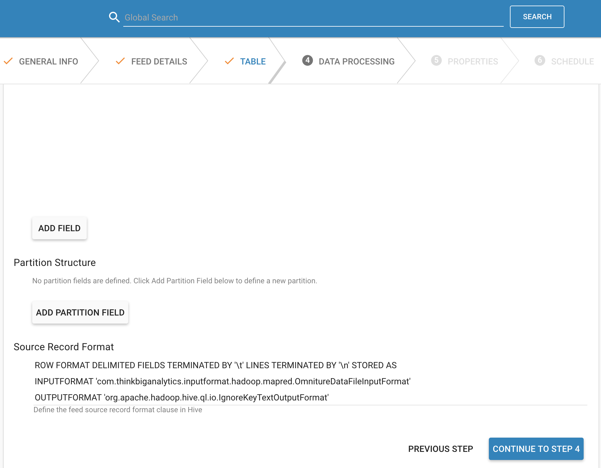
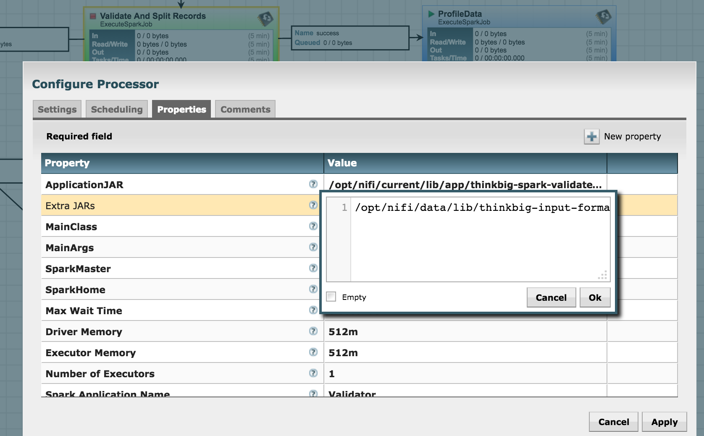

# Omniture Data

## Overview

This is a slight modification of https://github.com/msukmanowsky/OmnitureDataFileInputFormat to make it work with older `org.apache.hadoop.mapred` API.

A tool for Hadoop eco system that makes it easier to parse Omniture Click Stream data. 
It consists of custom input format and line reader. Works identically to TextInputFormat 
except for the fact that it uses a EscapedLineReader which gets around Omniture's pesky escaped 
tabs and newlines. For more information about format, please refer to Omniture Documentation 
https://marketing.adobe.com/resources/help/en_US/sc/clickstream/analytics_clickstream.pdf.

## License
https://github.com/msukmanowsky/OmnitureDataFileInputFormat/blob/master/LICENSE

## Authors
* Satish Iyengar - [Gannett](http://gannett.com)
* Mike Sukmanowsky - (Parsely Inc)

## How to use

### Create Table

    CREATE TABLE (...)
    ROW FORMAT DELIMITED FIELDS TERMINATED BY '\t' 
    STORED AS 
    INPUTFORMAT 'com.thinkbiganalytics.inputformat.hadoop.mapred.OmnitureDataFileInputFormat' 
    OUTPUTFORMAT 'org.apache.hadoop.hive.ql.io.IgnoreKeyTextOutputFormat';

#### In Feed Manager

### Add to HiveServer2
* `mkdir /usr/hdp/current/hive-server2/auxlib`
* `cp thinkbig-input-format-omniture.jar /usr/hdp/current/hive-server2/auxlib/`
* Restart hive server

### ExecuteSparkProcessor class path

#### On local file system
* Location must be readable by `nifi` user
* `cp thinkbig-input-format-omniture.jar /opt/nifi/data/lib/`
* Ensure readable by nifi user `chown nifi:users /opt/nifi/data/lib/kylo-input-format-omniture.jar`
* Ensure executable by nifi user `chmod u+x /opt/nifi/data/lib/kylo-input-format-omniture.jar`
* Restart Nifi
* Go to Nifi
* Find `Validate And Split Records` processor and stop it
* Open its configuration properties
* Set `Extra JARs` property of ExecuteSparkProcessor to `/opt/nifi/data/lib/kylo-input-format-omniture.jar`
* Repeat for all other ExecuteSparkProcessors

#### on HDFS
* TODO

